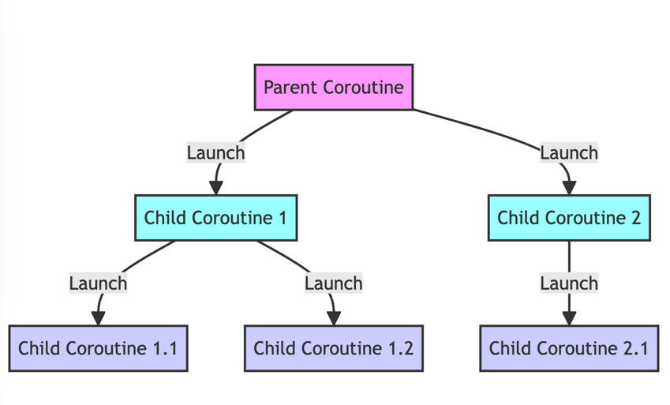

## CoroutineContext
### CoroutineContextの種類
- Coroutineにはからなず一つのCoroutineContextが紐づいている
- CoroutineContextはCoroutineの実行環境を表す
  - 実行スレッドの指定
  - Coroutineのキャンセル
  - エラーハンドリング
- スレッドを指定するDispatchersと、キャンセルを管理するJobがある
  - Dispatchers
    - 実行するスレッドを指定できる
      - `Dispatchers.Default` : バックグラウンドで実行
      - `Dispatchers.IO` : ネットワークやディスクアクセス
      - `Dispatchers.Main` : メインスレッドで実行
  - Job
    - Coroutineのキャンセルを管理する
    - jobを指定していない場合はキャンセルできない
- Dispatchers と　Job の要素を併せ持ったCoroutineContextを作成できる
  - `val context = Job() + Dispatchers.Default`

### CoroutineContextの伝播
- CoroutineContextは親Coroutineから子Coroutineに伝播される
  - 例えば・・・
    - 親Coroutineが`Dispatchers.Main`で実行されている場合、子Coroutineも`Dispatchers.Main`で実行される
    - 親Coroutineが`Job()`でキャンセルされた場合、子Coroutineもキャンセルされる
    

### CoroutineContextの変更
- CoroutineContextのDispatchersは、処理の途中で変更できる
  - 例えば、UIスレッドで処理を進め、途中からIOスレッドにスレッドを切り替えることができる

### Coroutineに名前をつける
- CoroutineNameを指定することで、Coroutineに名前をつけることができる
  - `val context = Job() + Dispatchers.Default + CoroutineName("CoroutineName")`
  - CoroutineNameはデバッグ時に便利